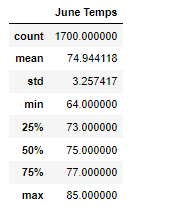
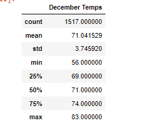

# Surfs_Up
## Overview
The purpose of the Surfs Up analysis was to analyze weather data in Oahu for several years to determine if opening a surf shop was sustainable year-round. In the initial analysis we observed weather data of an entire year and in the secondary analysis, we observed weather data in the months of June and December.

## Intial Analysis results
In the initial analysis we filtered our data for the specific date range of August 2016 to August 2017. In this analysis it was determined that there were 9 active weather stations, with the most active station having a record count of 2772. Summary Statistics of the specific weather station show that the station had recorded a minmum temperature of 54.0, maximum temperature of 85.0 and an average temperatur of 72.0. Through the percipitation plot we can determine that some months have higher amounts of percipitation than others.

## Secondary Analysis Reults: June and December
1. Our temperarture summary statistics show that June typically has a higher mean temperature at 74.9 compared to December at 71.0.
2. Where 50% of the temperatures recorded for June were above 75.0, median temperature for December was 71.0
3. June has a minimum temperature of 64.0 while December has a minimum temperature of 56.0

